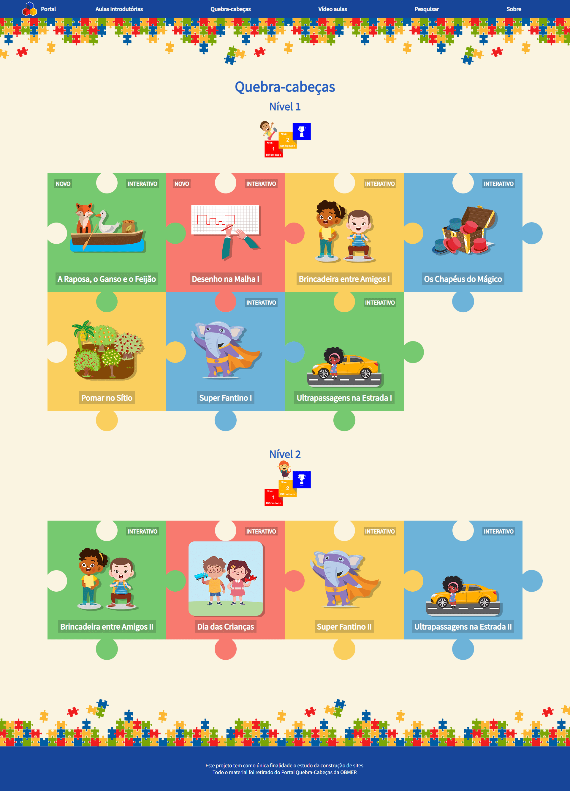
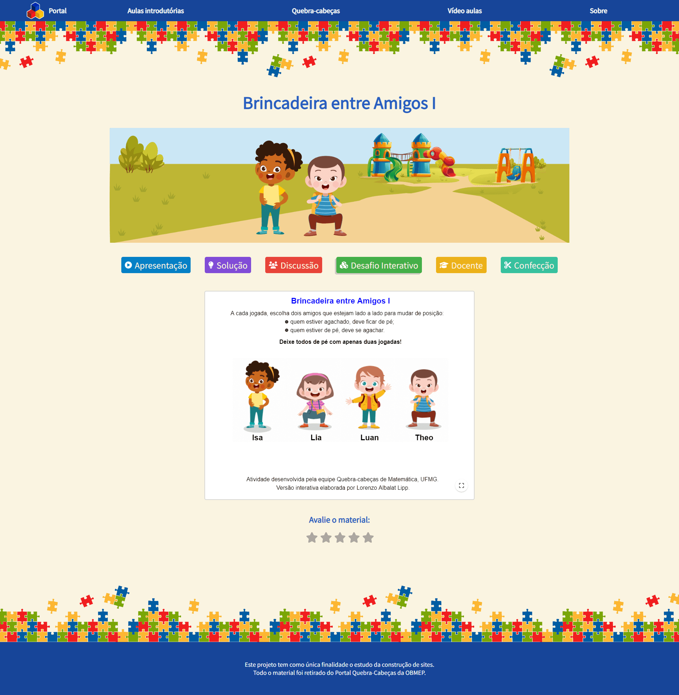
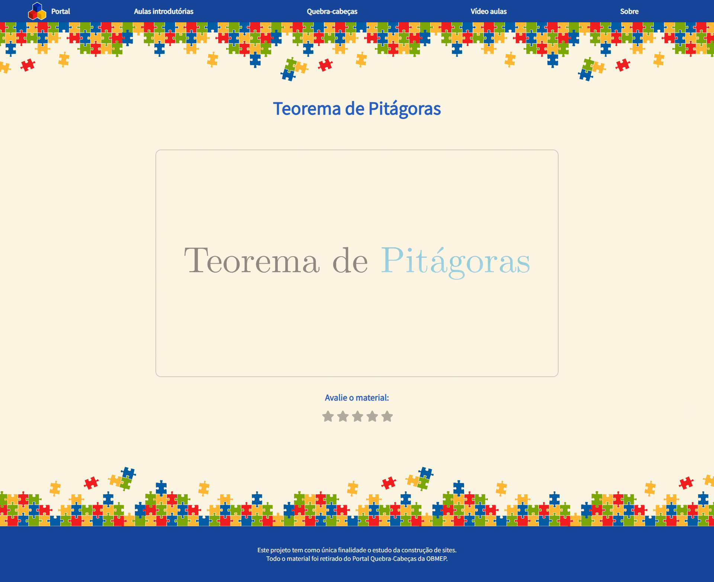

## Portal da OBMEP

Este é um projeto com a finalidade de estudar a construção de sites usando React e a visualização mobile de PDFs sem a necessidade de download.

A proposta inicial foi de refazer o site do [Portal da OBMEP](https://portaldaobmep.impa.br/index.php/modulo/index?a=4), tornando-o responsivo e mais atrativo para o público-alvo (infantil).

O site encontra-se disponível em: [https://quebracabecas.github.io/](https://quebracabecas.github.io/)

É possível reproduzir esse site usando:

```
npm install
npm run build
```

E então substituindo os arquivos index.html, assets/intex.js e assets/index.css do repositório [https://github.com/quebracabecas/quebracabecas.github.io](https://github.com/quebracabecas/quebracabecas.github.io) pelos arquivos gerados na pasta dist.

## Visualização da página inicial


## Visualização da lista de quebra-cabeças


## Visualização da lista de aulas introdutórias


## Visualização da lista de vídeos


## Visualização de um desafio interativo


## Visualização do PDF de um desafio


## Visualização da ferramenta de pesquisa


## Visualização do sistema de avaliação


## Visualização de um dos vídeos
